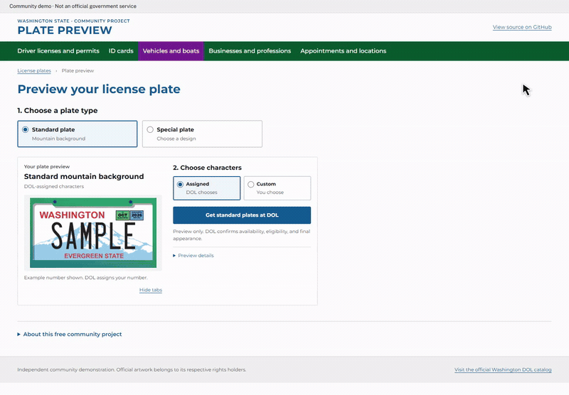

# Washington Plate Preview

Explore Washington license plate designs and try your own characters in a live preview.

[](https://github.com/gavinwright-engr/washington-license-plate-preview/actions/workflows/checks.yml)



[Watch the full-quality video](docs/media/demo.mp4) · [Desktop](docs/media/desktop.png) · [Mobile](docs/media/mobile.png)

- **Compare options:** separate standard and special plates, cost groups, and a compact searchable gallery of all 75 entries.
- **Try your characters:** live format feedback, original-sample comparison, and optional month/year tabs.
- **Easy to embed:** responsive HTML, CSS, and JavaScript. No dependencies, build step, accounts, or tracking.

## Try it

Clone the repository or choose **Code → Download ZIP**, then run:

```sh
python3 -m http.server 8000 --directory dist
```

Open **http://localhost:8000**. The readable files in `dist/` are the source.

To add the preview to an existing website, follow the [integration guide](docs/INTEGRATION.md).

## Status

An independent prototype using published DOL samples. Personalized lettering, reconstructed backgrounds, and date tabs are approximate. Availability and final approval remain with DOL; this preview does not check or reserve a number.

**Verified:** 14 automated checks, all 75 catalog entries, and documented desktop/mobile browser checks. [See the verification record](docs/VERIFICATION.md). Run the tests with `node --test`.

## License

Original code and documentation: [MIT](LICENSE). DOL artwork and bundled fonts have [separate rights and licenses](ASSET-LICENSES.md).

<details>
<summary>Technical reference</summary>

- [Integration and API](docs/INTEGRATION.md)
- [Artwork and rendering](docs/ARTWORK.md) · [Font calibration](docs/FONTS.md)
- [Sources](docs/SOURCES.md) · [Security and privacy](docs/SECURITY.md)
- [Fee scope and sources](docs/FEES.md)
- [Contributing](CONTRIBUTING.md)

</details>
