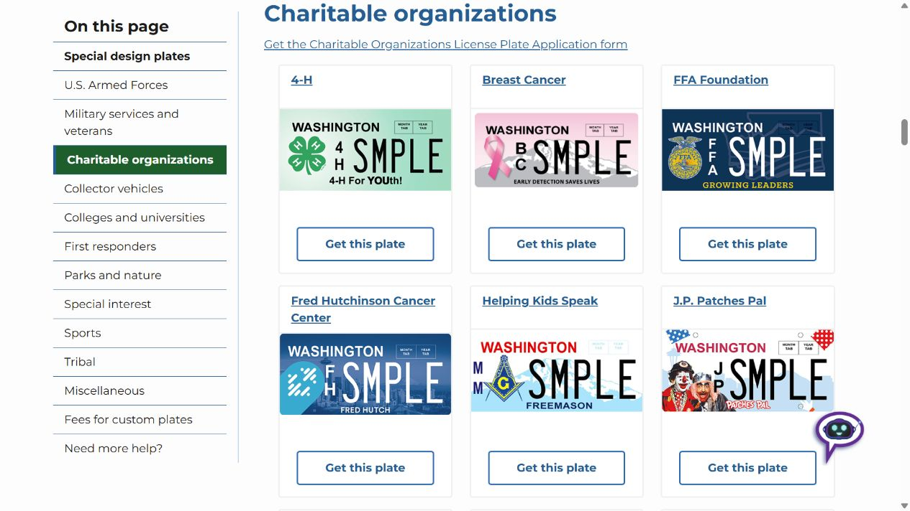
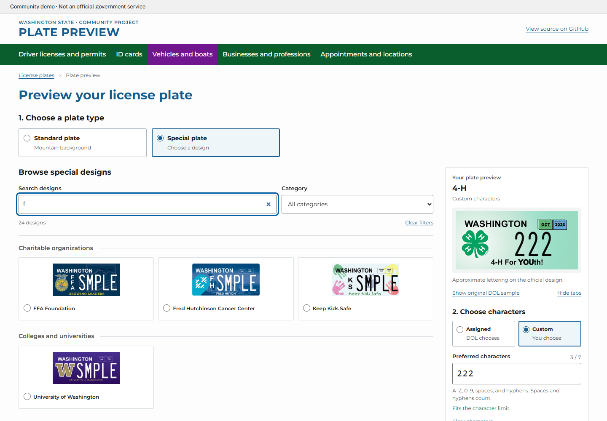

# Current page and proposed preview

This prototype builds on the [DOL special-design catalog](https://dol.wa.gov/vehicles-and-boats/vehicles/license-plates/special-design-plates), which already groups designs by category and links to application information.

## Current DOL catalog

The [Charitable organizations section](https://dol.wa.gov/vehicles-and-boats/vehicles/license-plates/special-design-plates#charitableorganizations) shows published samples and a link for each plate. Visitors use category links to move through the catalog.

Screenshot captured October 2, 2026. This is an unaltered viewport capture of the existing page, scrolled to Charitable organizations.

## Proposed interaction

The prototype adds design search and filtering, a compact preview beside the gallery, and custom characters that update on the selected design. Standard and special plates each offer assigned or custom characters where supported. Excess input is blocked with visible feedback.

In this example, searching **f** immediately includes **Fred Hutchinson Cancer Center**, while the selected **4-H** design previews **222**. All special entries are available when filters are cleared.

[Watch the 23-second preview](https://github.com/gavinwright-engr/washington-license-plate-preview#demo) directly in the project page.

DOL's eligibility rules, availability checker, fees, and application process remain authoritative. Custom rendering is approximate. Depicted artwork retains its [separate rights](../ASSET-LICENSES.md).
